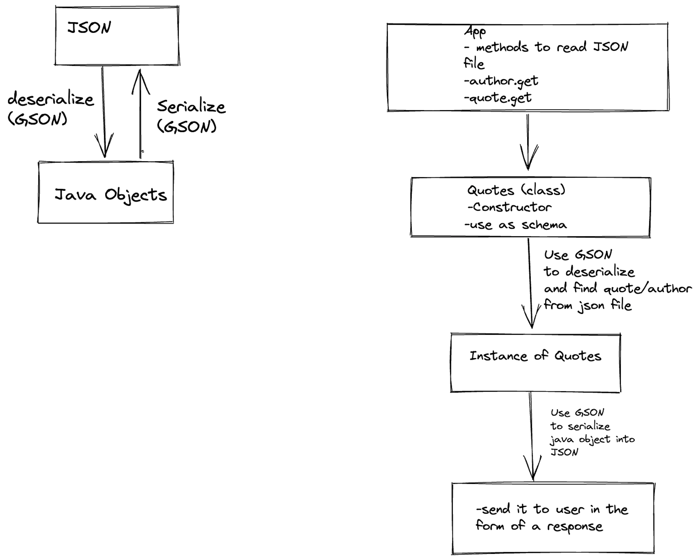

# quotes
Prints quotes from a json file

## Directions for user

Use `./gradlew run --args "args"` to run the application. For `args[0]` use `author` to search by author, `contains` to search a quote with a given word, and `random` for a random quote.

## Domain Modeling

